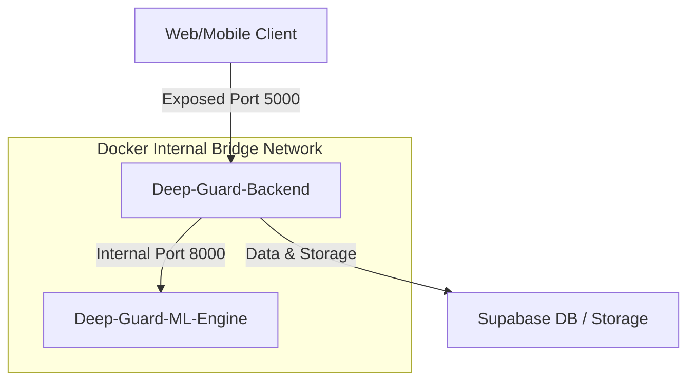

# 🛡️ Deep-Guard Integrated Backend Orchestration

Welcome to the **Deep-Guard Integrated Backend** configuration engine. This folder serves as the central hub for local multi-service orchestration and containerized production deployment templates for the core backend microservices.

By utilizing **Docker Compose**, this orchestrator seamlessly bridges:
1. **`Deep-Guard-Backend`**: The core API service (Node.js & Express).
2. **`Deep-Guard-ML-Engine`**: The high-performance AI/ML inference service (FastAPI & TensorFlow Lite).

---

## 🏗️ System Architecture & Connectivity

The services communicate over an isolated internal Docker bridge network, restricting access to the heavy machine learning layers and exposing only the secure API layer to the public network.



---

## 🛠️ Local Development Quickstart

### Prerequisites
- [Docker](https://www.docker.com/products/docker-desktop/) installed on your machine.
- [Docker Compose](https://docs.docker.com/compose/) v2+.

### 1. Environment Variable Setup
Ensure you have a `.env` file present in the `Deep-Guard-Integrated-Backend` root directory with the following variables configured:

```env
# Database & Cloud Storage (Supabase)
SUPABASE_URL=https://your-project.supabase.co
SUPABASE_ANON_KEY=your-supabase-anon-key
SUPABASE_BUCKET_NAME=your-storage-bucket
SERVICE_ROLE_KEY=your-supabase-service-role-key

# Security & Sessions
JWT_SECRET=your-secure-access-jwt-secret
JWT_REFRESH_SECRET=your-secure-refresh-jwt-secret
ENABLE_CSRF_CHECK=true
FRONTEND_URL=http://localhost:3000

# Optional Integrations
GOOGLE_CLIENT_ID=your-google-oauth-client-id
OPENAI_API_KEY=your-openai-api-key

# SMTP Credentials (for notifications & OTPs)
EMAIL_USER=your-email@gmail.com
EMAIL_PASSWORD=your-app-password
SMTP_HOST=smtp.gmail.com
SMTP_PORT=587
```

### 2. Launch the Orchestrated Stack
From this directory, spin up all containers:

```bash
docker compose up --build
```

- 🚀 **Core Backend API** is reachable at [http://localhost:5000](http://localhost:5000)
- 🧠 **ML Engine Microservice** runs internally in the Docker network at `http://deep-guard-ml-engine:8000` (Port `8000` is also mapped locally for testing, allowing you to access Swagger/OpenAPI docs at [http://localhost:8000/docs](http://localhost:8000/docs)).

---

## 🐋 Manual Single-Container Workflows

If you wish to build or run either backend microservice manually without using Docker Compose, you can run the following commands:

```bash
# Build the individual images
docker build -t deep-guard-backend ../Deep-Guard-Backend
docker build -t deep-guard-ml-engine ../Deep-Guard-ML-Engine

# Launch the ML microservice first
docker run --rm -p 8000:8000 deep-guard-ml-engine

# Launch the API backend next (linked to the host/local port)
docker run --rm -p 5000:5000 --env-file .env deep-guard-backend
```

> [!IMPORTANT]
> When running containers manually, configure `ML_API_URL`, `ML_VIDEO_URL`, and `ML_IMAGE_URL` inside your backend's environment variables to target the exact host network address of the ML service.

---

## 🚀 Production Deployment (Render)

Render supports robust multi-service orchestrated deployments. We recommend setting up two distinct services:

1. **API Web Service (`Deep-Guard-Backend`)**:
   - **Type**: Web Service.
   - **Dockerfile**: Use `Deep-Guard-Backend/Dockerfile`.
   - **Exposed Port**: `5000`.
   - **Environment Variables**: Populate all database credentials and set `ML_API_URL` to point to the ML Engine Private Service URL.

2. **ML Inference Service (`Deep-Guard-ML-Engine`)**:
   - **Type**: Private Service (internal, no public internet access).
   - **Dockerfile**: Use `Deep-Guard-ML-Engine/Dockerfile`.
   - **Exposed Port**: `8000`.

> [!TIP]
> Deploying the `Deep-Guard-ML-Engine` as a **Private Service** ensures that only the API backend can execute raw deepfake analysis requests, establishing strict security boundaries.
